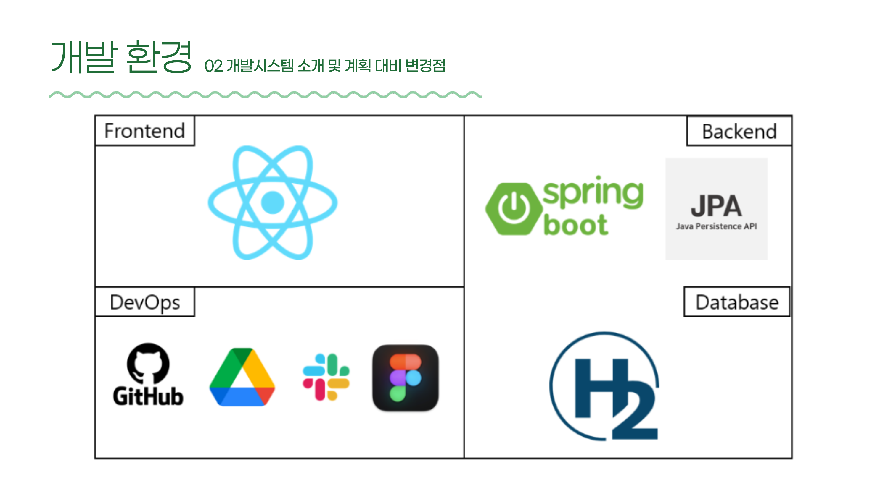
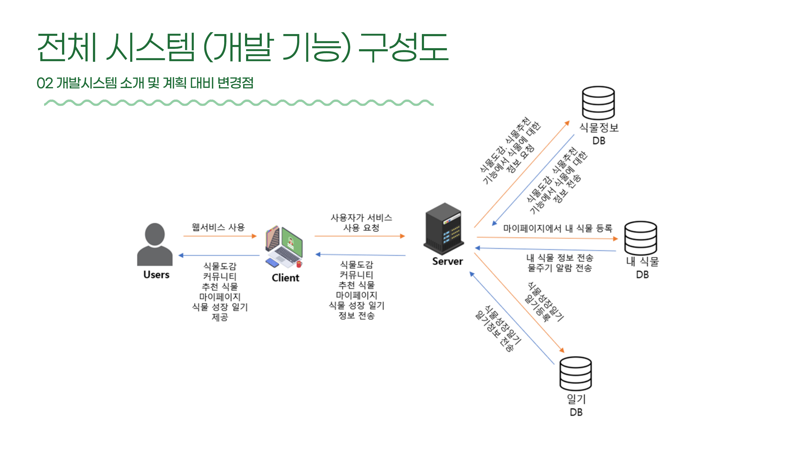
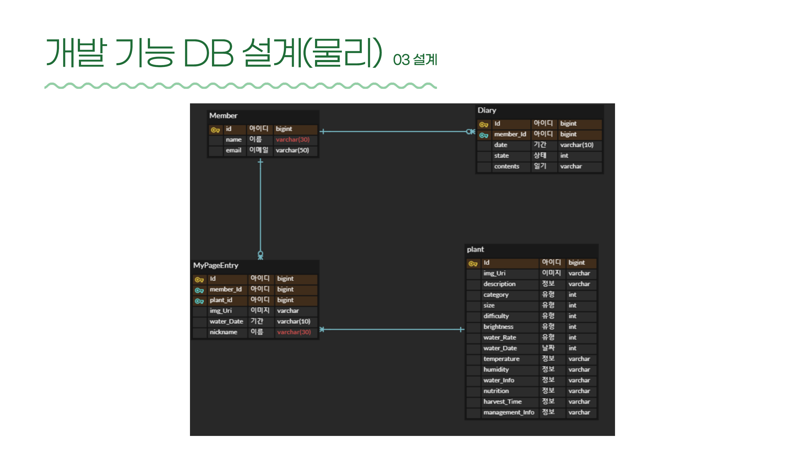
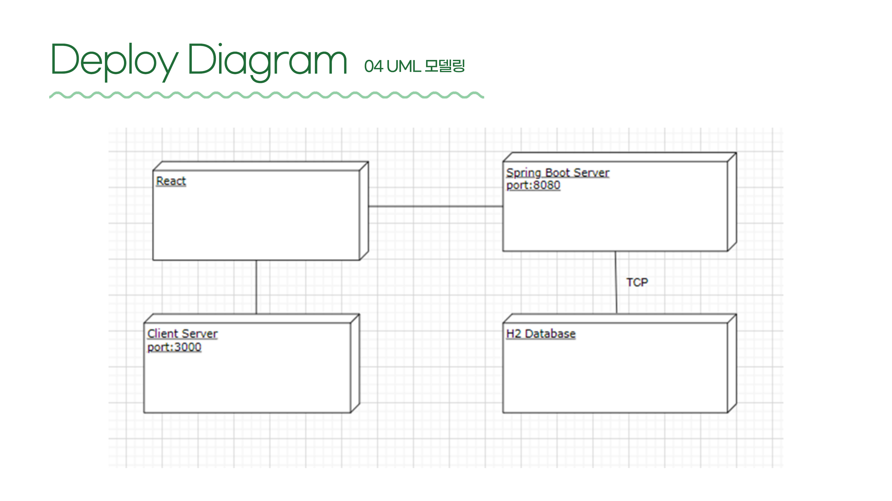

<h1 align="center">맛있는 녀석들</h1>
<p align="center"><b>식용가능 작물 관리 웹서비스</b></p>
<p align="center">
  
  
  
  
</p>
<p align="center">22년도 2학기 [소프트웨어공학] · 아주대학교</p>

이 레포는 **프론트엔드(React)** 코드를 담고 있으며, 프로젝트 전체를 소개하는 대표 레포입니다.
백엔드(Spring Boot API 서버)는 별도 레포에서 관리합니다.

**🔗 Backend Repository: [식용가능작물관리웹서비스-BE](https://github.com/<organization>/<be-repo-name>)**

> 위 링크는 실제 BE 레포 주소로 교체해 주세요.

---

## 목차

1. [프로젝트 소개](#프로젝트-소개)
2. [주요 기능](#주요-기능)
3. [기술 스택](#기술-스택)
4. [시스템 아키텍처](#시스템-아키텍처)
5. [DB 설계](#db-설계)
6. [배포 구조](#배포-구조)
7. [요구사항 / 제약사항](#요구사항--제약사항)
8. [프로젝트 진행 (일정 관리)](#프로젝트-진행-일정-관리)
9. [테스트](#테스트)
10. [실행 방법](#실행-방법)
11. [팀원 및 역할](#팀원-및-역할)
12. [레포지토리 구성](#레포지토리-구성)

---

## 프로젝트 소개

코로나19 이후 우울증 위험군이 이전 대비 5배 이상 증가하는 등 정신건강 문제가 심화되었고, 반려식물을 기르는 것이 외로움·우울감 해소에 효과적이라는 조사 결과(외로움 해소 93%, 우울감 해소 92%)가 있었습니다. 실제로 가정에서 기르기 쉬운 쌈채소·루콜라·토마토 등 식용작물의 온라인 판매량도 전년 대비 큰 폭으로 증가하는 추세입니다.

하지만 작물마다 기르는 방법이 다르고, 초보자가 혼자서 정보를 찾고 관리하기는 쉽지 않습니다. **맛있는 녀석들**은 이런 문제를 해결하기 위한 **식용작물 전용 웹서비스**로,

- 다양한 작물의 재배 방법을 손쉽게 찾아보고
- 마이페이지에서 내가 키우는 작물을 등록·관리하고
- 나에게 맞는 작물을 추천받아

**식물의 고사율을 낮추고 재배에 대한 진입장벽을 낮춰, 집에서도 성공적으로 작물을 재배할 수 있도록** 돕는 것을 목표로 합니다.

## 주요 기능

| 기능 | 설명 |
| :--- | :--- |
| 🌿 **식물도감** | 원하는 식물의 이름을 검색하면 영양소, 물 주는 시기, 수확 시기, 재배 환경 등의 정보를 확인할 수 있습니다. |
| 🪴 **마이페이지** | 내가 기르는 식물을 등록해 키우기 시작한 날짜, 식물 정보 등을 관리하고, 물주기 알림을 받을 수 있습니다. |
| 📔 **식물 성장 일기** | 내가 기르는 식물에 대한 성장 일기를 작성할 수 있습니다. 식물의 대표 상태를 선택하고 간단한 일기를 남길 수 있습니다. |
| 🔍 **식물 추천** | 식물의 종류, 사이즈, 재배 난이도, 영양성분, 재배환경을 설문으로 입력하면 조건에 맞는 최적의 식물을 추천해 줍니다. |

> 기획 초기에는 로그인/회원가입, 커뮤니티(질문 게시판·자유 게시판) 기능도 포함되어 있었으나, 개발 범위 조정을 거쳐 최종적으로 위 4개 핵심 기능을 중심으로 구현되었습니다.

## 기술 스택



| 구분 | 스택 |
| :--- | :--- |
| Frontend | React |
| Backend | Spring Boot, JPA |
| Database | H2 |
| DevOps | GitHub, Google Drive, Slack, Figma |

## 시스템 아키텍처



클라이언트(React)가 서버(Spring Boot)에 요청을 보내면, 서버는 용도에 따라 분리된 3개의 데이터베이스(식물정보 DB, 내 식물 DB, 일기 DB)와 통신하여 식물도감·식물추천·마이페이지·식물 성장 일기 기능에 필요한 데이터를 주고받습니다.

## DB 설계



| 테이블 | 설명 |
| :--- | :--- |
| `Member` | 사용자 정보(이름, 이메일) |
| `plant` | 식물도감 정보(이미지, 소개, 유형, 재배 난이도, 물주기 정보, 영양성분, 수확시기, 관리방법 등) |
| `MyPageEntry` | 사용자가 마이페이지에 등록한 내 식물 정보(애칭, 이미지, 최근 물 준 날짜) |
| `Diary` | 식물 성장 일기(작성 날짜, 식물 대표 상태, 일기 내용) |

## 배포 구조



- **Client Server** (React, `port: 3000`) ↔ **Spring Boot Server** (`port: 8080`) ↔ **H2 Database** (TCP)

## 요구사항 / 제약사항

| ID | 항목 | 세부내용 |
| :--- | :--- | :--- |
| PER | 성능 | 사용자가 요청한 모든 기능의 결과를 적어도 2초 내에 반환해야 한다. |
| SWD | 소프트웨어 개발 방식 준수 | 스크럼 산출물(프로덕트 백로그, 스프린트 백로그, 번다운 차트)이 모두 작성되어야 하며, Slack 커밋 기록·주간 회의 기록이 있어야 한다. |
| ENV | 개발환경 | FE는 React, BE는 Spring Boot, DB는 H2 + JPA(ORM)를 사용하여 구축한다. |
| BRC | 브라우저 호환성 | 크롬, 파이어폭스, 사파리, 웨일 브라우저에서 모든 기능이 정상 작동해야 한다. |
| UFD | 유저 친화적 디자인 | 서비스의 모든 기능이 3번의 화면 전환 이내로 동작해야 한다. |
| PLDB | 식물 도감 데이터베이스 | 도감에 출력되는 식물 수가 30개 이상, 세부 정보 페이지에 출력되는 정보가 10개 이상이어야 한다. |

## 프로젝트 진행 (일정 관리)

- 총 5번의 스프린트로 진행 (개발기간 총 40일, 2022년 9월 ~ 12월)
- 프로덕트 백로그 → 스프린트 백로그 → 간트 차트 → 소멸 차트 순으로 일정을 관리
- 각 스프린트 종료 시점마다 진행 상황을 소멸 차트에 반영하고, 스프린트별 단위/통합 테스트를 진행

## 테스트

- **단위 테스트**: 식물도감, 식물 정보 보기, 식물 검색, 식물 추천 등 기능 단위 시나리오 기반 검증
- **통합 테스트**: 로그인 → 식물도감 진입 → 프리뷰 출력 등 여러 기능이 연계된 흐름 검증
- 요구사항 ID(DIC, REC, DIA, MYP, SWD, EXC, DBM 등) 별로 테스트 케이스를 매핑하여 결함 건수와 판정 결과를 추적 관리

## 실행 방법

```bash
# 1. 레포지토리 클론
git clone https://github.com/<organization>/<fe-repo-name>.git
cd <fe-repo-name>

# 2. 패키지 설치
npm install

# 3. 개발 서버 실행 (기본 포트 3000)
npm start
```

> 프론트엔드가 정상적으로 동작하려면 [백엔드 서버](https://github.com/<organization>/<be-repo-name>)가 `localhost:8080`에서 함께 실행되고 있어야 합니다. 백엔드 실행 방법은 BE 레포의 README를 참고해주세요.

## 레포지토리 구성

이 프로젝트는 프론트엔드와 백엔드가 **별도의 레포지토리**로 분리되어 있으며, 서로 API로 통신합니다.

| Repo | 역할 | 링크 |
| :--- | :--- | :--- |
| **FE (현재 레포)** | React 클라이언트, 프로젝트 전체 개요 문서 | 현재 위치 |
| **BE** | Spring Boot API 서버 | [바로가기](https://github.com/<organization>/<be-repo-name>) |
